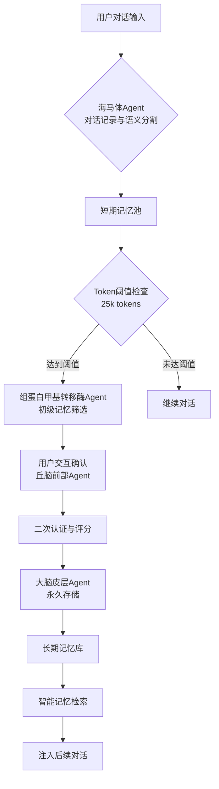

# 🧠 Four-Agent Memory Management Plugin for Claude Code

> **基于人脑记忆机制的四Agent协同系统，解决长对话场景下关键信息遗忘问题**

<p align="center">
  
  
  
  
  
</p>

<p align="center">
  <strong>将人类记忆巩固的科学原理应用于AI对话管理</strong>
</p>

## 🌟 核心特性

### 🧬 生物启发式架构
- **四Agent协同工作**：模拟人脑记忆环路的完整流程
- **Token智能管理**：自动监测上下文使用量，智能触发记忆巩固
- **用户交互确认**：关键记忆需要用户批准，确保质量与隐私
- **纯文件存储**：使用JSON + Markdown文件，无需外部数据库依赖

### ⚡ 自动化工作流程
- **智能阈值触发**：默认25,000 tokens自动启动记忆巩固
- **语义分割**：自动将对话分解为有意义的记忆片段
- **相关性检索**：根据当前对话智能注入相关历史记忆
- **持久化存储**：认证通过的记忆永久存储，支持跨会话检索

### 🔒 安全与隐私
- **本地优先**：所有数据存储在用户本地设备
- **用户授权**：无用户确认不写入永久记忆
- **无外部依赖**：不依赖云服务或第三方API
- **透明可控**：完整可查看的记忆生命周期管理

## 🏗️ 架构概览



### 🧩 四Agent详细职责

| Agent | 人脑对应区域 | 主要功能 | 输出 |
|-------|-------------|----------|------|
| **海马体** | 海马体 | 对话记录、语义分割、token计数 | 短期记忆片段 |
| **组蛋白甲基转移酶** | 前额叶皮层 | 记忆价值评估、重要性评分 | 候选记忆列表 |
| **丘脑前部** | 丘脑前部核 | 用户交互、反馈收集 | 用户认证结果 |
| **大脑皮层** | 大脑皮层 | 永久存储、索引建立、检索优化 | 长期记忆库 |

## 🚀 快速开始

### 前提条件
- **Claude Code** (最新版本)
- **Python 3.8+** (用于记忆处理逻辑)
- **Node.js 14+** (用于Hook系统)

### 安装步骤

1. **克隆仓库到Claude Code插件目录**
```bash
cd ~/.claude/plugins
git clone https://github.com/your-username/memory-management-plugin.git
```

2. **启用插件**
编辑Claude Code的`settings.json`文件，添加：
```json
{
  "enabledPlugins": {
    "memory-management": true
  }
}
```

3. **重启Claude Code**
插件将在下次启动时自动加载。

### 自动配置
首次运行时，插件会自动创建：
- `~/.claude/plugins/memory/config/config.json` - 配置文件
- `~/.claude/plugins/memory/data/` - 数据存储目录
- 完整的四Agent初始化

## ⚙️ 配置选项

默认配置文件位于：`~/.claude/plugins/memory/config/config.json`

```json
{
  "enabled": true,
  "auto_start": true,
  "debug": false,
  "token_threshold": 25000,
  "score_threshold": 60.0,
  "max_injection_tokens": 0.2
}
```

### 关键配置说明

| 参数 | 默认值 | 说明 |
|------|--------|------|
| `token_threshold` | 25000 | 触发记忆巩固的token阈值 |
| `score_threshold` | 60.0 | 记忆片段通过筛选的最低分数 |
| `max_injection_tokens` | 0.2 | 每次最多注入上下文token的比例 |
| `debug` | false | 调试模式，显示详细日志 |
| `auto_start` | true | Claude Code启动时自动开始记忆管理 |

## 📖 使用示例

### 场景：长对话技术咨询
1. **开始对话**：用户与Claude讨论Python API开发
2. **持续对话**：讨论数据库设计、认证、部署等话题
3. **阈值触发**：当对话达到25k tokens时，自动弹出记忆确认
4. **用户确认**：用户选择需要保留的关键技术要点
5. **记忆巩固**：选定的记忆永久存储
6. **后续对话**：当讨论相关话题时，自动注入历史记忆

### 手动测试插件功能
```bash
# 运行集成测试
cd ~/.claude/plugins/memory-plugin
python test_integration.py

# 测试协调器
python src/coordinator.py --test

# 查看系统状态
python src/coordinator.py --status
```

## 🔧 Hook系统详解

插件通过Claude Code的Hook系统实现自动化：

### PreToolUse Hook
- **时机**：用户输入前
- **功能**：检索相关记忆并注入到对话上下文
- **结果**：Claude获得历史相关信息的"记忆辅助"

### PostToolUse Hook
- **时机**：Claude输出后
- **功能**：记录本轮对话到记忆系统
- **结果**：对话内容被语义分割并暂存

### SessionStart Hook
- **时机**：会话开始时
- **功能**：初始化记忆管理系统
- **结果**：建立新的记忆管理会话

## 📊 数据存储结构

```
~/.claude/plugins/memory/data/
├── short-term/           # 短期记忆池（海马体）
│   ├── fragment_*.json   # 未处理的记忆片段
│   └── metadata.json     # 会话元数据
├── long-term/            # 长期记忆库（大脑皮层）
│   ├── topic_*/          # 按主题分类的记忆
│   └── index.json        # 记忆索引
├── sessions/             # 会话历史
│   └── session_*.json    # 完整的会话记录
├── interactions/         # 用户交互文件
│   └── interaction_*.md  # 记忆确认交互记录
└── config/               # 运行时配置
    └── config.json       # 当前配置
```

## 🧪 测试与验证

### 集成测试套件
```bash
# 运行完整测试套件
cd ~/.claude/plugins/memory-plugin
python test_integration.py
```

测试内容包括：
- ✅ 完整工作流程测试
- ✅ 记忆检索准确性验证
- ✅ 配置系统测试
- ✅ 错误处理鲁棒性测试

### 手动测试命令
```bash
# 测试记忆记录
node hooks/memory-hook.js record "用户输入" "Claude输出"

# 测试记忆检索
node hooks/memory-hook.js retrieve "查询关键词"

# 查看系统状态
node hooks/memory-hook.js status
```

## 🔍 工作原理深入

### 1. 记忆片段生成（海马体）
- **语义分析**：使用启发式规则识别对话中的关键信息
- **分块策略**：按话题、技术栈、决策点进行智能分割
- **元数据提取**：自动识别主题、关键词、重要性指标

### 2. 记忆价值评估（检察官）
- **多维度评分**：相关性、完整性、独特性、实用性
- **阈值过滤**：低于`score_threshold`的片段被自动过滤
- **优先级排序**：按重要性评分进行排序

### 3. 用户交互界面（丘脑前部）
- **交互式文件**：生成Markdown格式的确认文件
- **清晰展示**：展示片段内容、评分、推荐理由
- **多选项反馈**：支持批准、拒绝、稍后处理等操作

### 4. 永久存储优化（大脑皮层）
- **主题聚类**：相似记忆自动归类
- **索引优化**：快速检索的倒排索引
- **压缩存储**：去除冗余信息的优化存储

## 📈 性能指标

| 指标 | 典型值 | 说明 |
|------|--------|------|
| **记忆处理延迟** | <100ms | 单轮对话记录时间 |
| **检索响应时间** | <50ms | 相关记忆查找时间 |
| **片段处理能力** | 1000+片段 | 单次记忆巩固可处理量 |
| **存储效率** | ~5KB/片段 | 压缩后的平均存储大小 |
| **内存占用** | <50MB | 运行时内存使用 |

## 🛠️ 开发与扩展

### 项目结构
```
memory-management-plugin/
├── .claude-plugin/           # 插件元数据
├── src/                      # 四Agent核心逻辑
├── hooks/                    # Claude Code Hook系统
├── skills/                   # Claude Code技能文件
├── data/                     # 示例数据（运行时生成）
├── README.md                 # 本文档
├── SKILL.md                  # 技能描述文件
├── create_config.py          # 配置创建脚本
└── test_integration.py       # 集成测试
```

### 扩展可能性
1. **多语言支持**：扩展语义分析支持更多语言
2. **云同步**：可选的端到端加密云存储
3. **可视化界面**：记忆库的Web可视化界面
4. **API接口**：提供外部程序访问记忆库的API
5. **高级检索**：基于向量嵌入的语义检索

## 🤝 贡献指南

我们欢迎各种形式的贡献！

### 报告问题
请在GitHub Issues中详细描述问题，包括：
- 问题描述
- 复现步骤
- 预期行为与实际行为
- 环境信息（Claude Code版本、Python版本等）

### 提交代码
1. Fork本仓库
2. 创建功能分支 (`git checkout -b feature/amazing-feature`)
3. 提交更改 (`git commit -m 'Add amazing feature'`)
4. 推送到分支 (`git push origin feature/amazing-feature`)
5. 开启Pull Request

### 开发准则
- 遵循现有的代码风格
- 添加适当的测试用例
- 更新相关文档
- 确保向后兼容性

## 📜 许可证

本项目基于 **MIT License** 发布 - 查看 [LICENSE](LICENSE) 文件了解详情。

## 🙏 致谢

### 科学基础
- **记忆巩固理论**：基于海马体-大脑皮层协同的现代记忆研究
- **认知架构**：借鉴了ACT-R等认知架构的设计理念
- **信息检索**：应用了现代信息检索技术的优化策略

### 技术栈
- **Claude Code**：优秀的AI辅助开发环境
- **Python**：强大而简洁的后端逻辑语言
- **Node.js**：高效的Hook系统实现

### 灵感来源
- 人类记忆系统的优雅设计
- 长对话场景下的实际需求
- 开源社区的协作精神

## 📞 支持与反馈

- **GitHub Issues**：报告bug或请求功能
- **讨论区**：加入技术讨论
- **文档贡献**：帮助改进文档质量

---

<p align="center">
  <strong>让AI对话拥有持久的记忆，开启更智能的协作体验</strong>
</p>

<p align="center">
  <em>记忆是智慧的基石，我们让AI也拥有这项能力</em>
</p>

<p align="center">
  <sub>基于人脑记忆机制的四Agent协同系统 © 2024</sub>
</p>