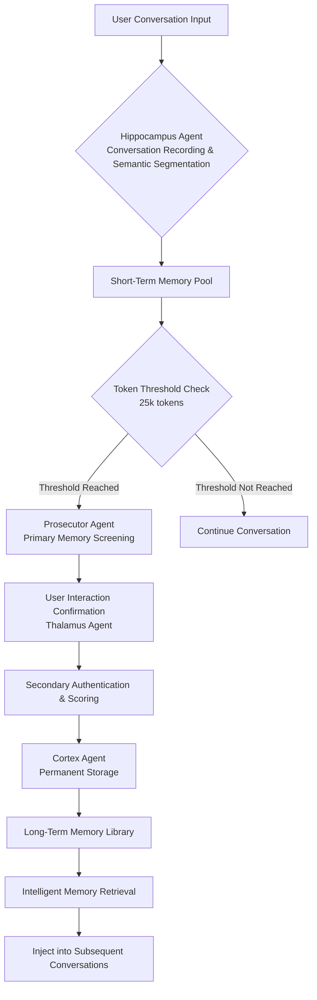

# 🧠 Four-Agent Memory Management Plugin for Claude Code

> **A biologically-inspired four-agent collaborative system that prevents key information from being forgotten in long conversations**

<p align="center">
  
  
  
  
  
</p>

<p align="center">
  <strong>Applying the scientific principles of human memory consolidation to AI conversation management</strong>
</p>

## 🌟 Core Features

### 🧬 Biologically-Inspired Architecture
- **Four-Agent Collaboration**: Simulates the complete workflow of the human memory loop
- **Intelligent Token Management**: Automatically monitors context usage and intelligently triggers memory consolidation
- **User Interaction Confirmation**: Critical memories require user approval to ensure quality and privacy
- **Pure File Storage**: Uses JSON + Markdown files, no external database dependencies

### ⚡ Automated Workflow
- **Smart Threshold Trigger**: Automatically starts memory consolidation at 25,000 tokens (default)
- **Semantic Segmentation**: Automatically decomposes conversations into meaningful memory fragments
- **Relevance Retrieval**: Intelligently injects relevant historical memories based on current conversation
- **Persistent Storage**: Approved memories are permanently stored and available for cross-session retrieval

### 🔒 Security and Privacy
- **Local-First**: All data is stored on the user's local device
- **User Authorization**: No memories are written to permanent storage without user confirmation
- **No External Dependencies**: No reliance on cloud services or third-party APIs
- **Transparent and Controllable**: Complete visibility and control over the memory lifecycle

## 🏗️ Architecture Overview



### 🧩 Four-Agent Detailed Responsibilities

| Agent | Brain Region | Main Function | Output |
|-------|-------------|---------------|--------|
| **Hippocampus** | Hippocampus | Conversation recording, semantic segmentation, token counting | Short-term memory fragments |
| **Prosecutor** | Prefrontal Cortex | Memory value assessment, importance scoring | Candidate memory list |
| **Thalamus** | Anterior Thalamic Nuclei | User interaction, feedback collection | User authentication results |
| **Cortex** | Cerebral Cortex | Permanent storage, index building, retrieval optimization | Long-term memory library |

## 🚀 Quick Start

### Prerequisites
- **Claude Code** (latest version)
- **Python 3.8+** (for memory processing logic)
- **Node.js 14+** (for hook system)

### Installation Steps

1. **Clone repository to Claude Code plugins directory**
```bash
cd ~/.claude/plugins
git clone https://github.com/your-username/memory-management-plugin.git
```

2. **Enable the plugin**
Edit Claude Code's `settings.json` file, add:
```json
{
  "enabledPlugins": {
    "memory-management": true
  }
}
```

3. **Restart Claude Code**
The plugin will automatically load on next startup.

### Automatic Configuration
On first run, the plugin automatically creates:
- `~/.claude/plugins/memory/config/config.json` - Configuration file
- `~/.claude/plugins/memory/data/` - Data storage directory
- Complete four-agent initialization

## ⚙️ Configuration Options

Default configuration file location: `~/.claude/plugins/memory/config/config.json`

```json
{
  "enabled": true,
  "auto_start": true,
  "debug": false,
  "token_threshold": 25000,
  "score_threshold": 60.0,
  "max_injection_tokens": 0.2
}
```

### Key Configuration Parameters

| Parameter | Default | Description |
|-----------|---------|-------------|
| `token_threshold` | 25000 | Token threshold to trigger memory consolidation |
| `score_threshold` | 60.0 | Minimum score for memory fragments to pass screening |
| `max_injection_tokens` | 0.2 | Maximum proportion of context tokens to inject each time |
| `debug` | false | Debug mode, shows detailed logs |
| `auto_start` | true | Automatically start memory management when Claude Code launches |

## 📖 Usage Examples

### Scenario: Long Technical Consultation
1. **Start Conversation**: User discusses Python API development with Claude
2. **Continue Conversation**: Topics include database design, authentication, deployment, etc.
3. **Threshold Trigger**: When conversation reaches 25k tokens, memory confirmation automatically pops up
4. **User Confirmation**: User selects key technical points to retain
5. **Memory Consolidation**: Selected memories are permanently stored
6. **Subsequent Conversation**: When discussing related topics, historical memories are automatically injected

### Manual Testing Plugin Functions
```bash
# Run integration tests
cd ~/.claude/plugins/memory-plugin
python test_integration.py

# Test coordinator
python src/coordinator.py --test

# Check system status
python src/coordinator.py --status
```

## 🔧 Hook System Details

The plugin achieves automation through Claude Code's Hook system:

### PreToolUse Hook
- **Timing**: Before user input
- **Function**: Retrieve relevant memories and inject into conversation context
- **Result**: Claude receives "memory assistance" with historical relevant information

### PostToolUse Hook
- **Timing**: After Claude output
- **Function**: Record current conversation turn to memory system
- **Result**: Conversation content is semantically segmented and temporarily stored

### SessionStart Hook
- **Timing**: When session starts
- **Function**: Initialize memory management system
- **Result**: Establish new memory management session

## 📊 Data Storage Structure

```
~/.claude/plugins/memory/data/
├── short-term/           # Short-term memory pool (Hippocampus)
│   ├── fragment_*.json   # Unprocessed memory fragments
│   └── metadata.json     # Session metadata
├── long-term/            # Long-term memory library (Cortex)
│   ├── topic_*/          # Memories categorized by topic
│   └── index.json        # Memory index
├── sessions/             # Session history
│   └── session_*.json    # Complete session records
├── interactions/         # User interaction files
│   └── interaction_*.md  # Memory confirmation interaction records
└── config/               # Runtime configuration
    └── config.json       # Current configuration
```

## 🧪 Testing and Validation

### Integration Test Suite
```bash
# Run complete test suite
cd ~/.claude/plugins/memory-plugin
python test_integration.py
```

Test coverage includes:
- ✅ Complete workflow testing
- ✅ Memory retrieval accuracy verification
- ✅ Configuration system testing
- ✅ Error handling robustness testing

### Manual Test Commands
```bash
# Test memory recording
node hooks/memory-hook.js record "User input" "Claude output"

# Test memory retrieval
node hooks/memory-hook.js retrieve "Query keywords"

# Check system status
node hooks/memory-hook.js status
```

## 🔍 How It Works (Deep Dive)

### 1. Memory Fragment Generation (Hippocampus)
- **Semantic Analysis**: Uses heuristic rules to identify key information in conversations
- **Chunking Strategy**: Intelligently segments by topic, tech stack, decision points
- **Metadata Extraction**: Automatically identifies themes, keywords, importance indicators

### 2. Memory Value Assessment (Prosecutor)
- **Multi-dimensional Scoring**: Relevance, completeness, uniqueness, practicality
- **Threshold Filtering**: Fragments below `score_threshold` are automatically filtered
- **Priority Sorting**: Sorted by importance score

### 3. User Interaction Interface (Thalamus)
- **Interactive Files**: Generate Markdown format confirmation files
- **Clear Display**: Shows fragment content, scores, recommendation reasons
- **Multi-option Feedback**: Supports approve, reject, process later operations

### 4. Permanent Storage Optimization (Cortex)
- **Topic Clustering**: Similar memories automatically categorized
- **Index Optimization**: Fast retrieval inverted index
- **Compressed Storage**: Optimized storage removing redundant information

## 📈 Performance Metrics

| Metric | Typical Value | Description |
|--------|---------------|-------------|
| **Memory Processing Latency** | <100ms | Single conversation turn recording time |
| **Retrieval Response Time** | <50ms | Relevant memory lookup time |
| **Fragment Processing Capacity** | 1000+ fragments | Single memory consolidation processing capacity |
| **Storage Efficiency** | ~5KB/fragment | Average storage size after compression |
| **Memory Usage** | <50MB | Runtime memory usage |

## 🛠️ Development and Extension

### Project Structure
```
memory-management-plugin/
├── .claude-plugin/           # Plugin metadata
├── src/                      # Four-Agent core logic
├── hooks/                    # Claude Code Hook system
├── skills/                   # Claude Code skill files
├── data/                     # Example data (generated at runtime)
├── README.md                 # This documentation (Chinese)
├── README_EN.md              # English documentation
├── SKILL.md                  # Skill description file
├── create_config.py          # Configuration creation script
└── test_integration.py       # Integration tests
```

### Extension Possibilities
1. **Multi-language Support**: Extend semantic analysis to support more languages
2. **Cloud Sync**: Optional end-to-end encrypted cloud storage
3. **Visualization Interface**: Web-based visualization interface for memory library
4. **API Interface**: Provide API for external programs to access memory library
5. **Advanced Retrieval**: Semantic retrieval based on vector embeddings

## 🤝 Contribution Guidelines

We welcome all forms of contribution!

### Reporting Issues
Please describe issues in detail in GitHub Issues, including:
- Problem description
- Reproduction steps
- Expected behavior vs actual behavior
- Environment information (Claude Code version, Python version, etc.)

### Submitting Code
1. Fork this repository
2. Create feature branch (`git checkout -b feature/amazing-feature`)
3. Commit changes (`git commit -m 'Add amazing feature'`)
4. Push to branch (`git push origin feature/amazing-feature`)
5. Open Pull Request

### Development Guidelines
- Follow existing code style
- Add appropriate test cases
- Update relevant documentation
- Ensure backward compatibility

## 📜 License

This project is released under the **MIT License** - see the [LICENSE](LICENSE) file for details.

## 🙏 Acknowledgements

### Scientific Foundation
- **Memory Consolidation Theory**: Based on modern memory research of hippocampus-cortex collaboration
- **Cognitive Architecture**: Inspired by design concepts from ACT-R and other cognitive architectures
- **Information Retrieval**: Applied optimization strategies from modern information retrieval technologies

### Technology Stack
- **Claude Code**: Excellent AI-assisted development environment
- **Python**: Powerful and concise backend logic language
- **Node.js**: Efficient Hook system implementation

### Inspiration Sources
- The elegant design of the human memory system
- Practical needs in long conversation scenarios
- The collaborative spirit of the open-source community

## 📞 Support and Feedback

- **GitHub Issues**: Report bugs or request features
- **Discussions**: Join technical discussions
- **Documentation Contributions**: Help improve documentation quality

---

<p align="center">
  <strong>Give AI conversations lasting memory, enabling more intelligent collaboration experiences</strong>
</p>

<p align="center">
  <em>Memory is the foundation of wisdom - we give AI this capability too</em>
</p>

<p align="center">
  <sub>Four-Agent Collaborative System Based on Human Memory Mechanisms © 2024</sub>
</p>